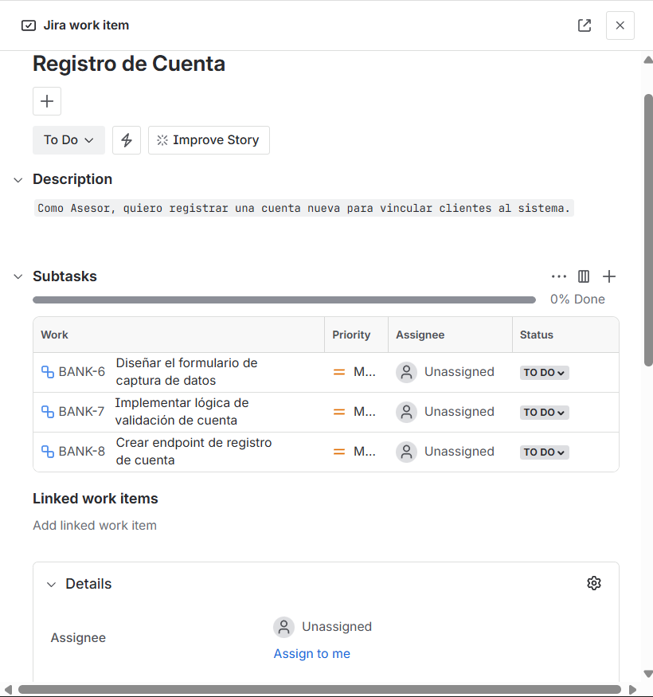
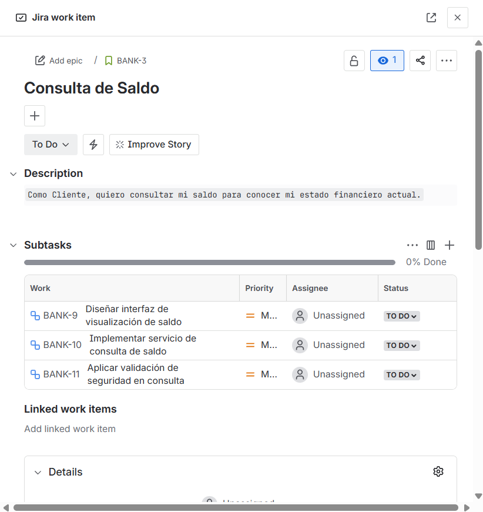
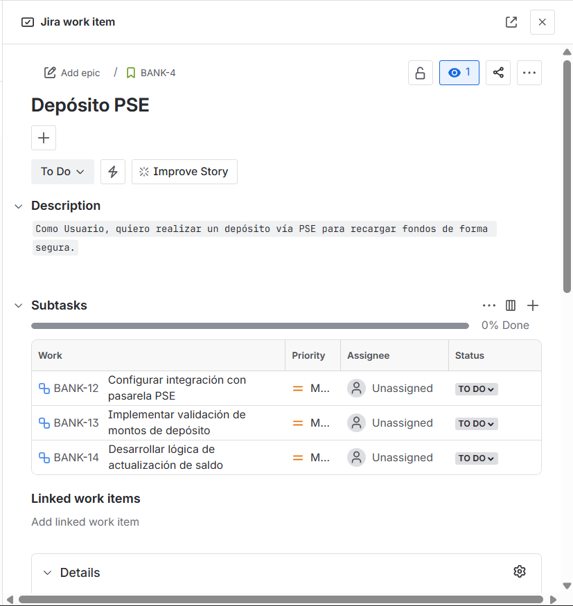
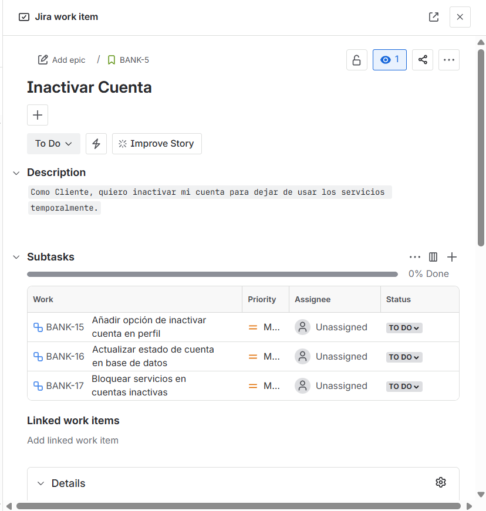
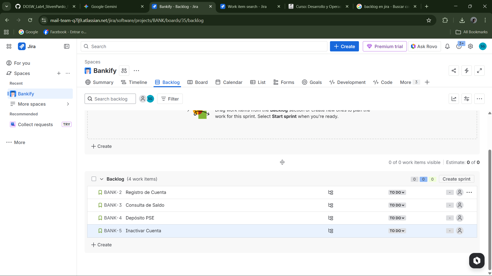
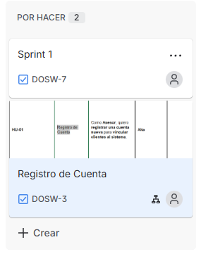
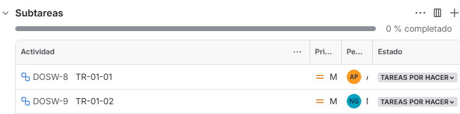

# Planeación del Sistema en Jira

## Desglose de trabajo: Épicas, Historias de Usuario y Tareas

La implementación de los requerimientos identificados de Bankify se desglosa de la siguiente manera:

### Épica:

### Historias de usuario:

### Tareas:
*(Las tareas se evidencian dentro del Backlog y las Historias de Usuario)*

### Cronograma:

### Backlog:

## Sprint Backlog

### Captura del Sprint 1

### Captura del Sprint 2

### Historias seleccionadas para el Sprint 1
| ID Jira | Título | Prioridad | Estimación | Justificación |
|---------|--------|-----------|------------|---------------|
| DOSW-3 | Registro de Cuenta | Alta | - | Base funcional del sistema, necesaria para todas las demás operaciones |

### Tareas incluidas en el Sprint 1
- **TR-01-01**: Diseño de formulario (Asignada a: [Andres Pineda])
- **TR-01-02**: Implementación de validaciones (Asignada a: [Nicolas Sanchez])

### Captura subtareas

### Justificación de la planeación
Para el primer sprint seleccionamos la historia **Registro de Cuenta (DOSW-3)** porque:

1. **Prioridad Alta**: Es la base funcional del sistema según el análisis en scrum_work_bankify.md.
2. **Dependencias**: Las demás historias dependen de que existan cuentas registradas.
3. **Capacidad del equipo**: Con 2 tareas técnicas podemos completar la historia en 4 semanas.
4. **Reglas de negocio**: Implementa las validaciones críticas (10 dígitos, código de banco) solicitadas por el gerente de Bankify.